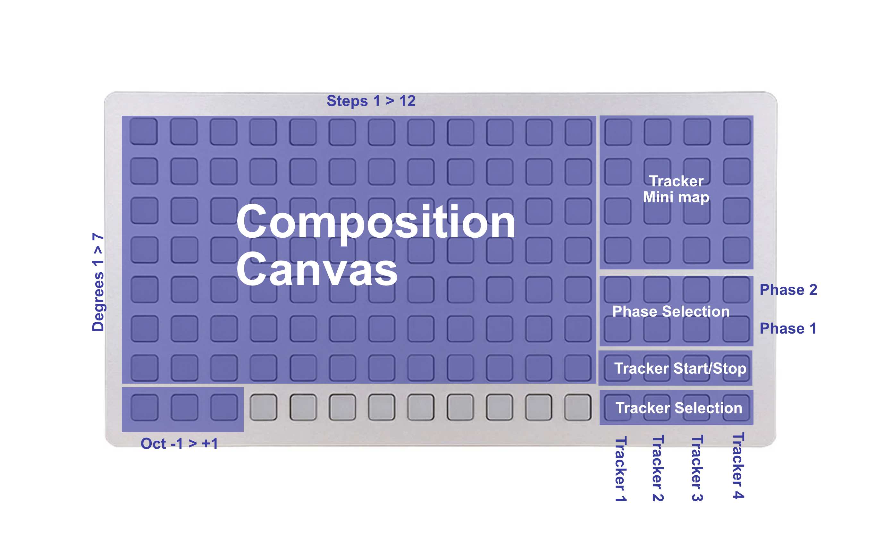

# Two Phase, Polyphonic Trackers for Norns and Grid

### Quickstart
#### Navigation
- Grid broken into two core sections: Composition Canvas and Control Panel
#### Grid Composition Canvas
- Program notes to steps
- Each column is a step, each row is a degree
- Three keys on bottom left allow you to change octave
#### Grid Control Panel
- Use `Tracker Minimap` to select active length
- `Phase Selection` to compose steps for A and B phase of the tracker
- `Tracker Play State` to toggle tracker on and off
- `Tracker Selection` to select active tracker
### Other Things To Know
- Each tracker has a clock divider/multiplier
- Each tracker can choose between one or two phases and the number of loops on each
- Holding the active tracker button in `Tracker Selection` and pressing a step allows you to jump directly to editing that step
- Steps can be any length
